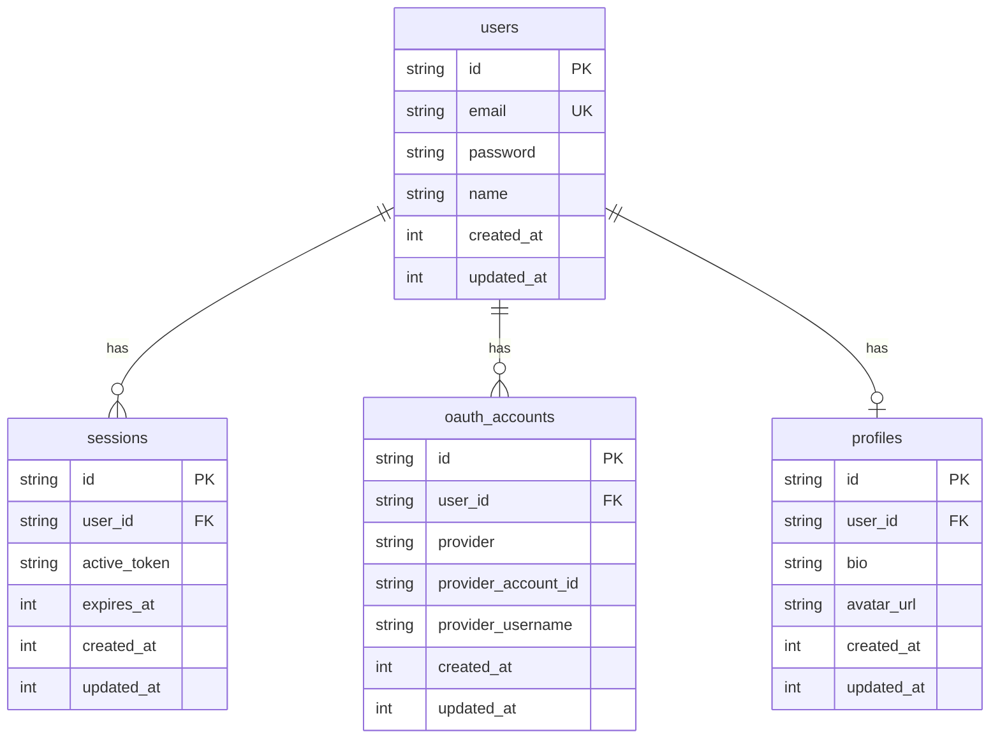

# Database Architecture

## Overview

Our database architecture is built on SQLite using Drizzle ORM, focusing on modularity, type safety, and separation of concerns. The architecture is designed to be easily maintainable and scalable, with clear separation between different features and their associated database models.

## Directory Structure

Our database layer follows a modular, feature-based approach:

```bash
src/
├── server/
│   └── db/
│       ├── client.ts      # Database client setup
│       ├── config.ts      # Drizzle configuration
│       └── schemas/
│           └── index.ts   # Schema exports
└── modules/
    ├── auth/
    │   └── models/
    │       ├── z.user.ts
    │       ├── z.session.ts
    │       └── z.oauth.ts
    └── profile/
        └── models/
            └── z.profile.ts
```

## Core Components

### Database Client (`client.ts`)

```typescript
import { drizzle } from "drizzle-orm/better-sqlite3";
import Database from "better-sqlite3";
import { env } from "@/env.mjs";

const sqlite = new Database(env.DATABASE_URL);
export const db = drizzle(sqlite);
```

### Configuration (`config.ts`)

```typescript
import type { Config } from "drizzle-kit";
import { env } from "@/env.mjs";

export default {
  schema: "./src/server/db/schemas/index.ts",
  out: "./src/server/db/migrations",
  driver: "better-sqlite",
  dbCredentials: {
    url: env.DATABASE_URL,
  },
} satisfies Config;
```

### Schema Exports (`schemas/index.ts`)

```typescript
export * from "@modules/auth/models/z.user";
export * from "@modules/auth/models/z.session";
export * from "@modules/auth/models/z.oauth";
export * from "@modules/profile/models/z.profile";
```

## Authentication Models

### User Model (`z.user.ts`)

```typescript
import { sqliteTable, text, integer } from "drizzle-orm/sqlite-core";

export const users = sqliteTable("users", {
  id: text("id", { length: 36 }).notNull(),
  email: text("email").notNull().unique(),
  password: text("password"),
  name: text("name"),
  createdAt: integer("created_at").notNull().default(0),
  updatedAt: integer("updated_at").notNull().default(0),
}, (table) => ({
  pk: primaryKey(table.id),
}));
```

### Session Model (`z.session.ts`)

```typescript
import { sqliteTable, text, integer } from "drizzle-orm/sqlite-core";
import { users } from "./z.user";

export const sessions = sqliteTable("sessions", {
  id: text("id", { length: 36 }).notNull(),
  userId: text("user_id").notNull().references(() => users.id, { onDelete: "cascade" }),
  activeToken: text("active_token").notNull(),
  expiresAt: integer("expires_at").notNull(),
  createdAt: integer("created_at").notNull().default(0),
  updatedAt: integer("updated_at").notNull().default(0),
}, (table) => ({
  pk: primaryKey(table.id),
}));
```

### OAuth Model (`z.oauth.ts`)

```typescript
export const OAuthProvider = {
  GITHUB: "GITHUB",
  GOOGLE: "GOOGLE",
} as const;

export const oauthAccounts = sqliteTable("oauth_accounts", {
  id: text("id", { length: 36 }).notNull(),
  userId: text("user_id").notNull().references(() => users.id, { onDelete: "cascade" }),
  provider: text("provider", { enum: ["GITHUB", "GOOGLE"] }).notNull(),
  providerAccountId: text("provider_account_id").notNull(),
  providerUsername: text("provider_username"),
  createdAt: integer("created_at").notNull().default(0),
  updatedAt: integer("updated_at").notNull().default(0),
}, (table) => ({
  pk: primaryKey(table.id),
  unq1: unique().on(table.provider, table.providerAccountId),
  unq2: unique().on(table.userId, table.provider),
}));
```

## Relationships



## Environment Configuration

We use Zod for runtime validation of environment variables:

```typescript
// env.mjs
import { z } from "zod";

const schema = z.object({
  DATABASE_URL: z.string().min(1),
  NODE_ENV: z.enum(["development", "production", "test"]),
});

const parsed = schema.safeParse(process.env);

if (!parsed.success) {
  console.error("❌ Invalid environment variables:", parsed.error.toString());
  process.exit(1);
}

export const env = parsed.data;
```

## Module Resolution

Our TypeScript configuration includes path aliases for clean imports:

```json
{
  "compilerOptions": {
    "baseUrl": ".",
    "paths": {
      "@/*": ["./src/*"],
      "@modules/*": ["src/modules/*"],
      "@server/*": ["src/server/*"]
    }
  }
}
```

## Server Components

Example of a server component using the database:

```typescript
import { db } from "@server/db/client";
import { users } from "@modules/auth/models/z.user";

export async function getUser(id: string) {
  return db.query.users.findFirst({
    where: eq(users.id, id),
    with: {
      profile: true,
      oauthAccounts: true,
    },
  });
}
```

## Migration Commands

Available commands for database management:

```bash
# Generate migrations
pnpm db:generate

# Push schema changes
pnpm db:push

# Open Drizzle Studio
pnpm db:studio
```

## Module Organization

Each feature module contains its own models with Zod-prefixed schema files:

```typescript
// Example: auth/models/z.user.ts
import { sqliteTable, text, integer } from "drizzle-orm/sqlite-core";

export const users = sqliteTable("users", {
  id: text("id", { length: 36 }).notNull(),
  email: text("email").notNull().unique(),
  password: text("password"),
  name: text("name"),
  createdAt: integer("created_at").notNull().default(0),
  updatedAt: integer("updated_at").notNull().default(0),
});
```

## Design Principles

1. **Modularity**: Each feature owns its database models
2. **Type Safety**: Full TypeScript support with Drizzle ORM
3. **Separation of Concerns**: Clear boundaries between modules
4. **Agnostic Design**: Easy to swap database providers

## Related Topics

<Cards>
  <Card 
    title="Database Setup" 
    href="/docs/database/setup"
    description="Learn how to set up the database layer" 
  />
  <Card 
    title="Database Schema" 
    href="/docs/database/schema"
    description="Explore our database models in detail" 
  />
  <Card 
    title="Authentication" 
    href="/docs/auth/overview"
    description="Learn about our authentication system" 
  />
</Cards> 