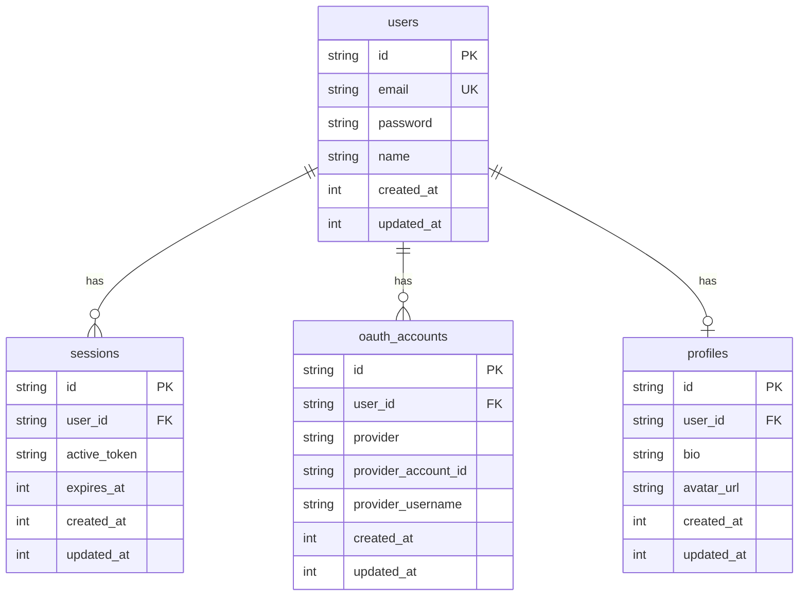

## Directory Structure

Our database layer follows a modular, feature-based approach:

```bash
src/
├── server/
│   └── db/
│       ├── client.ts      # Database client setup
│       ├── config.ts      # Drizzle configuration
│       └── schemas/
│           └── index.ts   # Schema exports
└── modules/
    ├── auth/
    │   └── models/
    │       ├── z.user.ts
    │       ├── z.session.ts
    │       └── z.oauth.ts
    └── profile/
        └── models/
            └── z.profile.ts
```

## Module Organization

Each feature module contains its own models with Zod-prefixed schema files:

```typescript
// Example: auth/models/z.user.ts
import { sqliteTable, text, integer } from "drizzle-orm/sqlite-core";

export const users = sqliteTable("users", {
  id: text("id", { length: 36 }).notNull(),
  email: text("email").notNull().unique(),
  password: text("password"),
  name: text("name"),
  createdAt: integer("created_at").notNull().default(0),
  updatedAt: integer("updated_at").notNull().default(0),
});
```

## Database Relationships



## Design Principles

1. **Modularity**: Each feature owns its database models
2. **Type Safety**: Full TypeScript support with Drizzle ORM
3. **Separation of Concerns**: Clear boundaries between modules
4. **Agnostic Design**: Easy to swap database providers

## Related Topics

<Cards>
  <Card
    title="Database Setup"
    href="/database/setup"
    description="Learn how to set up the database layer"
  />
  <Card
    title="Database Schema"
    href="/database/schema"
    description="Explore our database models in detail"
  />
  <Card
    title="Authentication"
    href="/auth/overview"
    description="Learn about our authentication system"
  />
</Cards>{" "}
